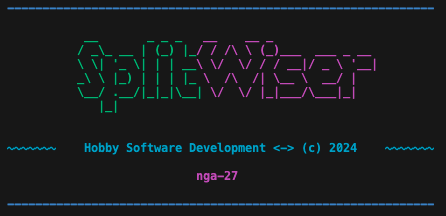
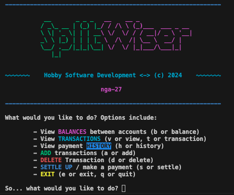
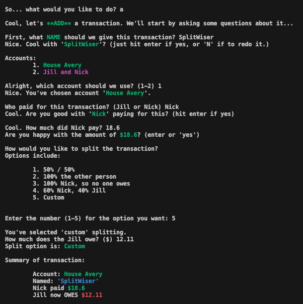
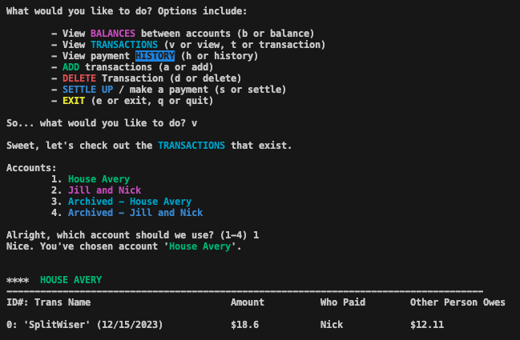
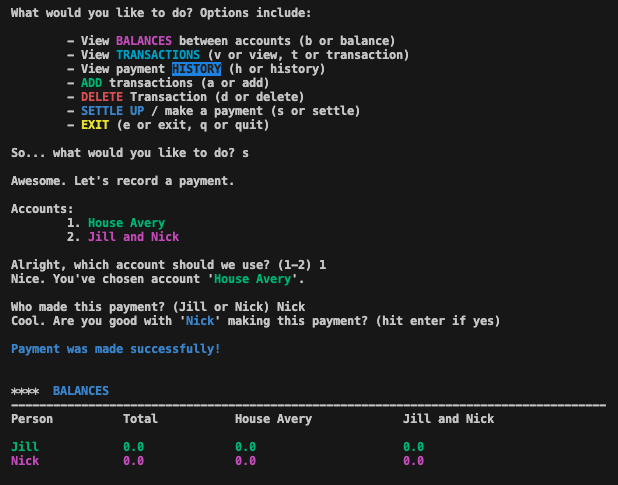

# SplitWiser
That greedy company that manages Splitwise decided that its users should pay way more than its ads, so to avoid the paywall, why not do it myself!



---

# Getting Started

To get started, you'll need an active Google [Account] and Google Drive instance installed on client computers. Yes, there is a Google Drive application, which more or less is just another folder + a sync on one's computer. (Think of OneDrive...)

Once that is configured, you'll want to `SaveAs` the `.env.example` file and place relative paths to the `SplitWiser.xlsx` db file (or whatever you're using). Once that's all set up, and your name is 'Nick' and 'Jill', you're good to go! (Perhaps future releases will be have configurable _everything_, including people and account names. Not today though.)

## Software Requirements

- python `3.11` is what is specified for this application
- `pyinstaller` if you wish to run this as a command application

## Installation

```sh
pip install .
```

For `pyinstaller` or `.exe` generation, you'll have to do:

```sh
pip install .[exe]
```

---

# To Run

From the root of the project, run:

```sh
python app.py
```

For API debugging, you can run `uvicorn` directly:
```sh
uvicorn api.server:app --log-level=warning --port=8765
```

---

# Other Nuggets & Menus

## Options



## Add a Transaction



## View a Transaction



## Settle a Debt


